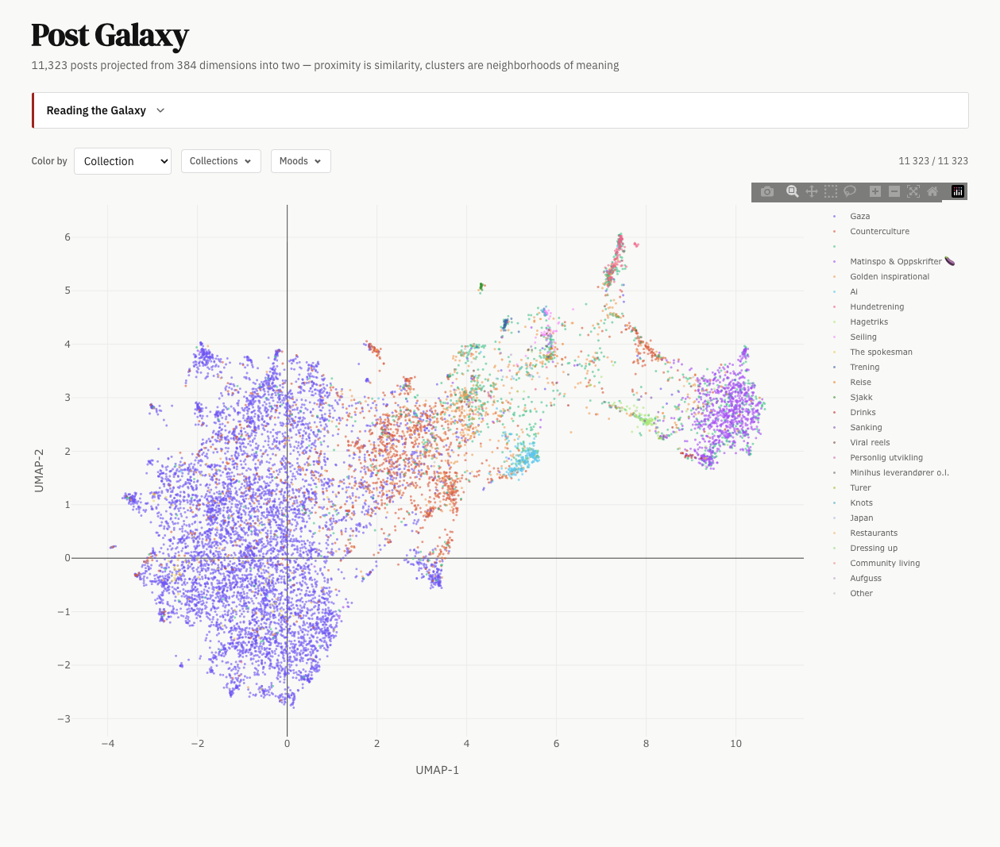

<div align="center">

```

 _           _            _    _ _ _
(_)_ __  ___| |_ __ _ ___| | _(_) | |
| | '_ \/ __| __/ _` / __| |/ / | | |
| | | | \__ \ || (_| \__ \   <| | | |
|_|_| |_|___/\__\__,_|___/_|\_\_|_|_|

```

**Your Instagram saved posts are a personal archive. This turns them into something you can search, explore, and learn from.**

[](https://claude.com/claude-code)
[](https://python.org)
[](https://claude.com)

[How it works](#how-it-works) · [Quick start](#quick-start) · [What you get](#what-you-get) · [Skills](#skills)

</div>

<br>

<div align="center">
  
  <br>
  <sub>11,323 saved posts projected from 384 dimensions into two — proximity is similarity, clusters are neighborhoods of meaning</sub>
</div>

<br>

---

Most people have thousands of saved Instagram posts sitting in a pile. You saved them for a reason — a recipe you wanted to try, a place you wanted to visit, an idea that stuck with you — but there's no way to search them, see patterns, or do anything with them at scale.

instaskill is a set of Claude Code skills that sync your saves, run them through a full analysis pipeline, and let you build deep dives on the collections that matter to you. The entire thing runs free on a Max plan.

---

## How it works

```
  ┌─────────────────┐     ┌─────────────────┐     ┌─────────────────┐
  │                  │     │                  │     │                  │
  │  1. SYNC         │────▶│  2. ANALYZE      │────▶│  3. DEEP DIVE    │
  │                  │     │                  │     │                  │
  │  Fetch saved     │     │  Embeddings,     │     │  Entities,       │
  │  posts from API, │     │  topics,         │     │  events,         │
  │  download media, │     │  sentiment,      │     │  narratives,     │
  │  transcribe      │     │  networks,       │     │  chronicles,     │
  │  audio + OCR     │     │  temporal        │     │  profiles,       │
  │                  │     │  patterns        │     │  frontend        │
  └─────────────────┘     └────────┬─────────┘     └─────────────────┘
                                   │
                                   │  ┌─────────────────┐
                                   └─▶│  4. VIDEO        │  (optional)
                                      │                  │
                                      │  Key frames →    │
                                      │  Opus analysis → │
                                      │  Gemini enrich → │
                                      │  merge           │
                                      └─────────────────┘
```

## Quick start

```bash
claude plugins add simonstrumse/instaskill
```

Then just tell Claude what you want:

```
Sync my Instagram saved posts
```
```
Analyze my saved posts — topics, sentiment, the whole thing
```
```
Build a deep dive on my "Cooking" collection
```
```
Extract recipes from the cooking reels
```

You don't need to remember skill names. Natural language works. Claude figures out which skill to run.

---

## What you get

<table>
<tr>
<td width="50%">

**After sync**
- All your saved posts as structured JSON
- Local copies of every image and video
- Whisper transcriptions + OCR text

</td>
<td width="50%">

**After analysis**
- 384-dim embeddings + UMAP galaxy view
- 10-20 auto-discovered topics
- Sentiment scores + 7-class emotion profiles
- Account networks + tag co-occurrence graphs
- Temporal patterns, bursts, psychological profile

</td>
</tr>
<tr>
<td width="50%">

**After deep dive**
- Entity extraction (alias-based or account-based)
- Event detection (z-score + PELT + Kleinberg)
- Narrative frame classification
- Chronicle prose (editorial, not bullet points)
- Person + account profile pages
- Convex-backed Next.js frontend

</td>
<td width="50%">

**After video analysis**
- Structured data from every reel
- Recipes, tutorials, exercises — whatever your videos contain
- Multi-model pipeline: Opus sees frames, Gemini watches full video
- Deterministic merge with trust hierarchy

</td>
</tr>
</table>

---

## Skills

| Skill | What it does | Input | Output |
|-------|-------------|-------|--------|
| `instagram-pipeline` | Sync saved posts, download media, Whisper + OCR | Chrome login | `saved_posts.json` + media |
| `instagram-analysis` | Embeddings, topics, sentiment, networks, temporal | `saved_posts.json` | Analysis data + dashboard |
| `instagram-deep-dive` | Entities, events, narratives, chronicles, profiles | Analyzed posts | Convex DB + Next.js |
| `video-analysis` | Key frames → Opus → Gemini → merge | Video files | Structured JSON |

The `instagram-pipeline` skill bundles runnable scripts directly. The other three are **template-driven** — the agent reads reference scripts and adapts them to your data, customizing paths, schemas, and domain logic for your collection.

<details>
<summary><strong>Templates</strong></summary>

```
templates/
├── pipeline/          # 10 analysis scripts (vision → export)
├── deep-dive/         # config.py + 11 scripts (extract → convex export)
├── video/             # 4 scripts (prepare → merge)
├── convex/            # Schema + query patterns with {prefix} placeholders
└── frontend/          # 5 annotated TSX patterns (layout → person detail)
```

</details>

<details>
<summary><strong>Reference docs</strong></summary>

| Doc | What it covers |
|-----|---------------|
| [`GOTCHAS.md`](plugins/instaskill/reference/GOTCHAS.md) | 20+ pitfalls: data types, Convex quirks, frontend traps, LLM variance |
| [`DATA_CONTRACT.md`](plugins/instaskill/reference/DATA_CONTRACT.md) | 9 table types with field names, types, indexes |
| [`DESIGN_SYSTEM.md`](plugins/instaskill/reference/DESIGN_SYSTEM.md) | Editorial design: fonts, colors, spacing, component patterns |

</details>

---

## Free vs. paid

The entire pipeline runs free on a Max plan — no API keys needed. Paid modes exist as optional accelerators:

| What | Free (Max plan) | Paid (API keys) |
|------|----------------|-----------------|
| Sync + download | Chrome cookies | — |
| Vision analysis | Claude subagents | Gemini 2.0 Flash |
| Synthesis | Claude subagents | Anthropic API |
| Embeddings, topics, sentiment | Local models | — |
| Video frame analysis | Claude subagents | Anthropic API |
| Video enrichment | Skip | Gemini API |
| Deep dive | Claude subagents | — |

## Requirements

- Python 3.10+ (3.12 recommended)
- Claude Code with Max plan
- macOS with Apple Silicon (for Whisper MLX + OCR)
- ffmpeg (`brew install ffmpeg`)
- Convex account (for deep dive frontend, optional)

---

## Design principles

- **Agentic-first.** Prefer LLM subagents over deterministic scripts. The quality ceiling is always higher.
- **Discovery over configuration.** Narrative frames, account types, and entity aliases emerge from your data — not copied from a template.
- **Trust hierarchy.** For multi-model pipelines: Opus = ground truth, Gemini = additive only, merge = deterministic.
- **Editorial, not SaaS.** The frontend follows data journalism aesthetics (ProPublica, The Pudding), not dashboard conventions.

---

<div align="center">
  <sub>Built by <a href="https://github.com/simonstrumse">Simon Strumse</a> · Powered by <a href="https://claude.com/claude-code">Claude Code</a></sub>
</div>
